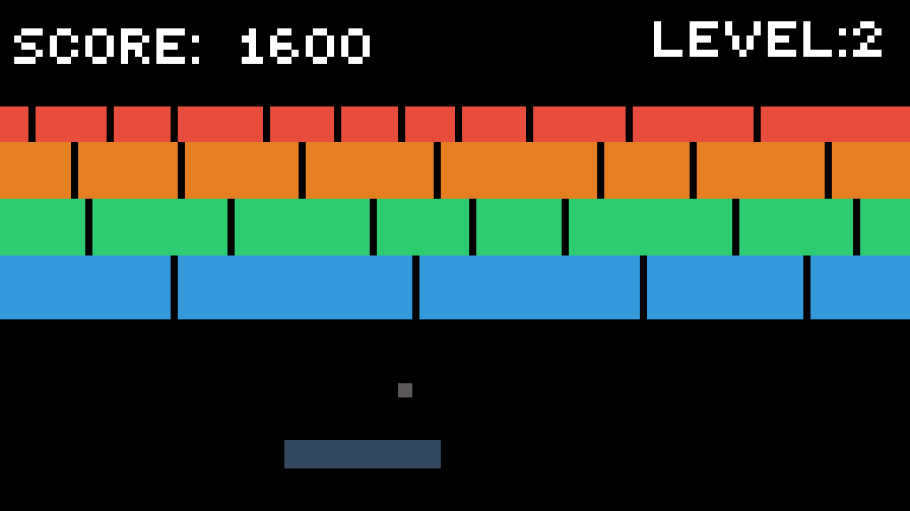

### Atari Breakout lite

---

### Descripción

Este es un simple juego de Atari Breakout implementado en HTML, CSS y JavaScript. El objetivo del juego es destruir todos los bloques utilizando una pelota controlada por una paleta.

### Cómo jugar

1. Abre el archivo `index.html` en tu navegador.
2. Utiliza las teclas de flecha derecha e izquierda o mueve el ratón para controlar la paleta.
3. Intenta romper todos los bloques con la pelota sin dejar que esta caiga.

### Funcionalidades

- Control de paleta con teclas de flecha y movimiento del ratón.
- Bloques de colores aleatorios.
- Detección de colisiones para rebotar la pelota y destruir bloques.
- Alerta de juego perdido y recarga de la página.

### Cómo contribuir

Si quieres contribuir al desarrollo del juego, sigue estos pasos:

1. Haz un fork del repositorio.
2. Clona tu fork: `git clone https://github.com/TU_USUARIO/atari-breakout.git`
3. Crea una rama para tus cambios: `git checkout -b tu-rama`
4. Realiza tus modificaciones y haz commit: `git commit -m "Añadir nuevas funcionalidades"`
5. Sube tus cambios: `git push origin tu-rama`
6. Abre un Pull Request en GitHub.

¡Esperamos tus contribuciones!

---

### Atari Breakout lite

---

### Description

This is a simple Atari Breakout game implemented in HTML, CSS, and JavaScript. The goal of the game is to destroy all the blocks using a paddle-controlled ball.

### How to Play

1. Open the `index.html` file in your browser.
2. Use the right and left arrow keys or move the mouse to control the paddle.
3. Try to break all the blocks with the ball without letting it fall.

### Features

- Paddle control with arrow keys and mouse movement.
- Randomly colored blocks.
- Collision detection to bounce the ball and destroy blocks.
- Game over alert and page reload.

### How to Contribute

If you want to contribute to the development of the game, follow these steps:

1. Fork the repository.
2. Clone your fork: `git clone https://github.com/YOUR_USERNAME/atari-breakout.git`
3. Create a branch for your changes: `git checkout -b your-branch`
4. Make your modifications and commit: `git commit -m "Add new features"`
5. Push your changes: `git push origin your-branch`
6. Open a Pull Request on GitHub.

We welcome your contributions!
